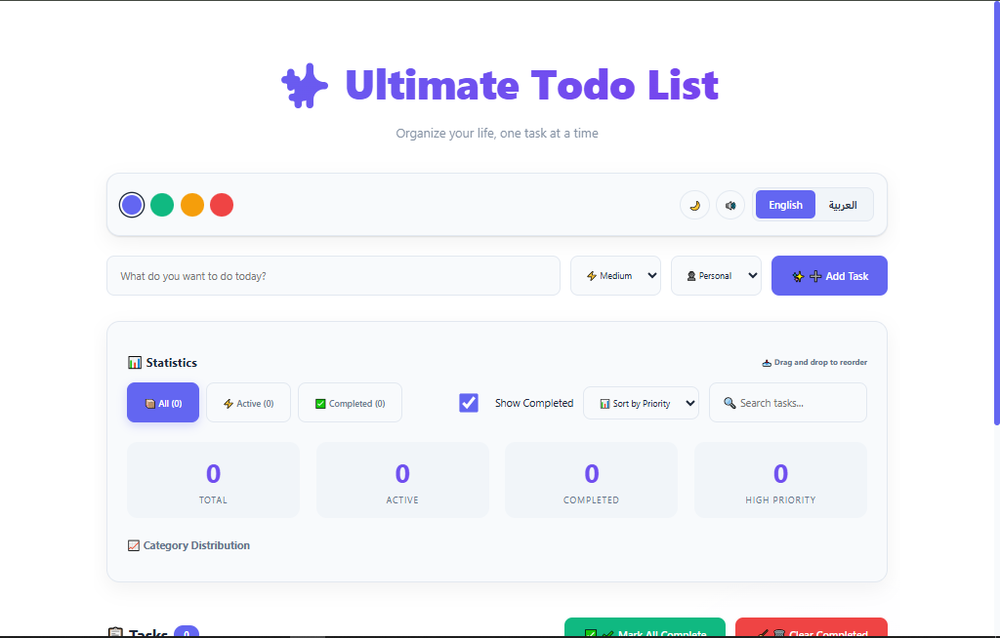
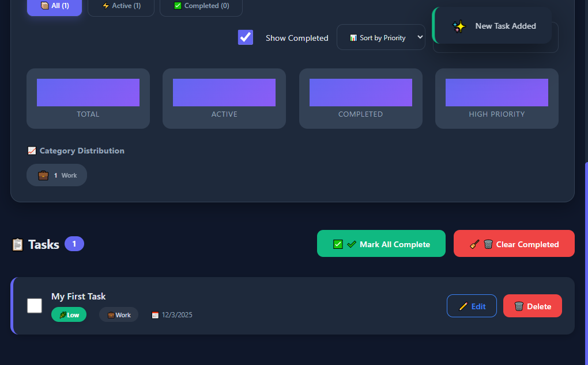

# Todo List App ✅

A modern and interactive **Todo List application** built with **React**.  
Users can **add, edit, delete, and mark tasks as completed**.  
This project demonstrates **CRUD operations, state management, and usage of LocalStorage** for data persistence.

---

## Technologies Used 🛠️
- React (Functional Components + Hooks)
- JavaScript (ES6)
- HTML5 & CSS3
- LocalStorage for data persistence

---

## Features ✨
- Add new tasks dynamically
- Edit and delete existing tasks
- Mark tasks as completed
- Persist tasks using LocalStorage
- Responsive design for desktop and mobile

---

## Screenshots 🖼️




*Screenshot shows the main interface with tasks list.*

---

## How to Run Locally 💻

1. Clone the repository:
```bash
git clone https://github.com/dido-iyad-dev/Todolist.git
```
Navigate to the project folder:

```bash
cd Todolist
```
Install dependencies:

```bash
npm install
```
Start the development server:

```bash
npm start
```

Open your browser at http://localhost:3000

Live Demo 🌐
Check out the live version of the project here:
!(https://todolist-iyad.netlify.app)

